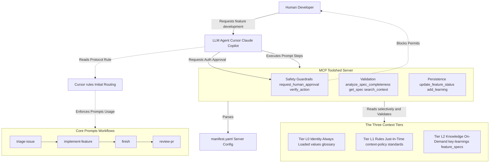

# Agent Context Kit Architecture

This documentation visually illustrates the infrastructure of the `agent-context-kit`, clearly showing the interaction between the human operator, the LLM agent, the editor context layers, and the MCP server infrastructure.

## 1. Structural Map (Components and Layers)
This tree diagram shows the high-level architecture of the kit, highlighting which elements live in the repository and how the various MCP components act as a bridge.

## 2. Sequence Diagram (Execution Flow)
This timeline demonstrates *when* and *how* tools and documents are queried step-by-step during a typical development cycle (e.g. an `/implement-feature`). It highlights the progressive hierarchy (from L0 to L2) designed to preserve the LLM context window layout.

```mermaid
sequenceDiagram
    autonumber
    actor Dev as Developer
    participant Agent as LLM Agent (Cursor)
    participant MCP as Toolshed (MCP Server)
    participant L0 as L0 (Identity)
    participant L1 as L1 (Rules)
    participant L2 as L2 (Deep Knowledge)
    participant Git as Local File System
    
    Dev->>Agent: "Develop Spec 15 (Shopping Cart)"
    
    rect rgb(30, 30, 50)
    Note over Agent,L0: Phase 1: Setup & Orientation (L0)
    Agent->>MCP: get_project_identity()
    MCP->>L0: Reads values.md, architecture.md
    MCP-->>Agent: Identity Standards & Values
    Agent->>MCP: get_guardrails()
    MCP-->>Agent: Blocked Actions & High-Risk Rules
    end
    
    rect rgb(40, 40, 20)
    Note over Agent,L1: Phase 2: Local Task Rules (L1)
    Agent->>MCP: get_rules("react-components")
    MCP->>L1: Reads Context Policy + UI Standards
    MCP-->>Agent: Just-In-Time Rules provided
    end
    
    rect rgb(20, 40, 40)
    Note over Agent,L2: Phase 3: Intent & Spec Validation (L2)
    Agent->>MCP: get_spec("shopping-cart")
    MCP->>L2: Searches the registry
    MCP-->>Agent: Fetches the feature spec details
    
    Agent->>MCP: analyze_spec_completeness("shopping-cart.md")
    MCP->>L2: Checks for the 8 Intent Engineering Fields
    MCP-->>Agent: "Spec is Complete!"
    end
    
    rect rgb(50, 30, 30)
    Note over Agent,Git: Phase 4: Safety Gates & Coding
    Agent->>MCP: request_human_approval("Modify DB Table", "high")
    MCP-->>Dev: Halts and Prompts User
    Dev-->>MCP: APPROVED
    MCP-->>Agent: Proceed
    
    Agent->>Git: Writes Application Code
    end

    rect rgb(30, 50, 40)
    Note over Agent,Git: Phase 5: Post-condition Verification (Finish)
    Agent->>MCP: verify_action("npm run test")
    MCP->>Git: Executes bash command
    MCP-->>Agent: Tests suite passed (exit 0)
    
    Agent->>MCP: validate_agent_report("PR Desc Text...")
    MCP-->>Agent: Missing Assumptions Node! (Retry)
    Agent->>Agent: Agent corrects its internal PR body state
    Agent->>MCP: validate_agent_report("PR Desc V2")
    MCP-->>Agent: Agent Report format validated!
    end
    
    Agent-->>Dev: "Development completed strictly following project rules!"
```

